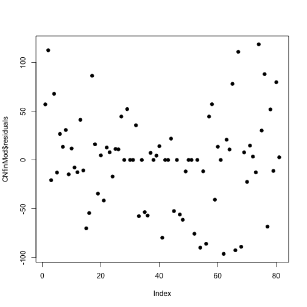
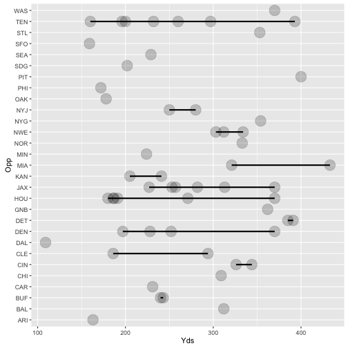
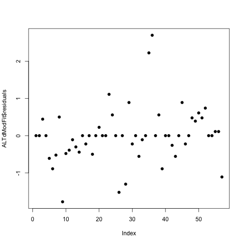
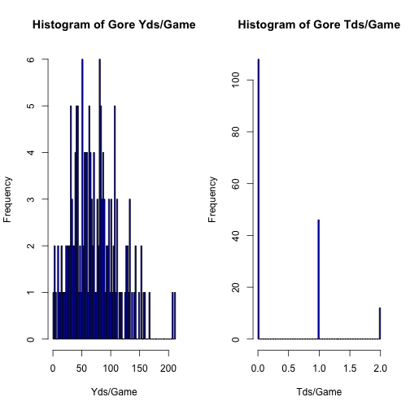

Player analysis and selection for the week of 09.19.2016


QB Analysis - Pull Player Data


RB Analysis - Pull Player Data


# QB Analysis

## Cam Newton - Summary Passing Data

Newton Yards Summary

```
##    Min. 1st Qu.  Median    Mean 3rd Qu.    Max. 
##   114.0   194.0   232.0   235.5   276.0   432.0
```

```
##    Min. 1st Qu.  Median    Mean 3rd Qu.    Max. 
##   0.000   1.000   1.000   1.506   2.000   5.000
```

```
## [1] 64.58116
```

```
## [1] 1.163222
```

Newton Histogram of Yards and TDs


Newton Yards LSE


Newton Yards Fitting a linear model using opponent data

```r
CNfitYds<- lm(Yds ~ Opp, data = CNdf)
summary(CNfitYds)$coefficients
```

```
##               Estimate Std. Error    t value     Pr(>|t|)
## (Intercept)  365.00000   44.41528  8.2178926 7.670142e-11
## OppATL      -142.40000   48.65450 -2.9267590 5.141819e-03
## OppBAL      -168.00000   76.92952 -2.1838170 3.369442e-02
## OppBUF      -136.00000   76.92952 -1.7678519 8.318722e-02
## OppCHI       -50.66667   57.33988 -0.8836200 3.811304e-01
## OppCIN       -81.00000   76.92952 -1.0529118 2.974433e-01
## OppCLE      -164.00000   76.92952 -2.1318214 3.795854e-02
## OppDAL      -157.00000   62.81269 -2.4994949 1.576487e-02
## OppDEN      -147.50000   62.81269 -2.3482516 2.285779e-02
## OppDET       -84.50000   62.81269 -1.3452695 1.846080e-01
## OppGNB       -53.66667   57.33988 -0.9359396 3.538029e-01
## OppHOU      -193.00000   62.81269 -3.0726275 3.430079e-03
## OppIND      -137.00000   62.81269 -2.1810879 3.390728e-02
## OppJAX      -198.50000   62.81269 -3.1601894 2.676464e-03
## OppKAN      -133.00000   76.92952 -1.7288552 9.000593e-02
## OppMIA      -191.00000   76.92952 -2.4827920 1.643614e-02
## OppMIN      -118.00000   54.39739 -2.1692219 3.484658e-02
## OppNOR      -140.30000   48.65450 -2.8835975 5.784024e-03
## OppNWE      -156.00000   76.92952 -2.0278301 4.792316e-02
## OppNYG       -96.66667   57.33988 -1.6858540 9.805552e-02
## OppNYJ       -92.00000   76.92952 -1.1958998 2.373764e-01
## OppOAK      -195.00000   76.92952 -2.5347876 1.442751e-02
## OppPHI       -95.33333   57.33988 -1.6626009 1.026496e-01
## OppPIT      -115.00000   76.92952 -1.4948748 1.412322e-01
## OppSDG      -134.00000   76.92952 -1.7418541 8.768325e-02
## OppSEA      -188.50000   54.39739 -3.4652400 1.096680e-03
## OppSFO      -104.00000   62.81269 -1.6557164 1.040431e-01
## OppSTL      -161.00000   76.92952 -2.0928247 4.146000e-02
## OppTAM      -136.12500   49.65779 -2.7412616 8.467263e-03
## OppTEN      -150.50000   62.81269 -2.3960126 2.035770e-02
## OppWAS      -130.66667   57.33988 -2.2788096 2.698326e-02
```
The intercept is the expected yardage (currently 365 yards).  According to the model, for the current week with the opponent being Atlanta, Cam's yardage would be 142 yards less than the intercept (223 yards) with a SE of 48.6 yards (high 272 yards, low 176 yards)

Newton Yards Plot of Data Yards against opponents

```
## Error in labs(x = label): object 'Yards' not found
```

```
## Error in labs(y = label): object 'Opponent' not found
```

```
## Warning in qt((1 - level)/2, df): NaNs produced

## Warning in qt((1 - level)/2, df): NaNs produced

## Warning in qt((1 - level)/2, df): NaNs produced

## Warning in qt((1 - level)/2, df): NaNs produced

## Warning in qt((1 - level)/2, df): NaNs produced

## Warning in qt((1 - level)/2, df): NaNs produced

## Warning in qt((1 - level)/2, df): NaNs produced

## Warning in qt((1 - level)/2, df): NaNs produced

## Warning in qt((1 - level)/2, df): NaNs produced
```


Newton Yards Fitting a linear model using location data

```r
CNfitYds2<- lm(Yds ~ Location, data = CNdf)
summary(CNfit2)$coefficients
```

```
##                Estimate Std. Error   t value     Pr(>|t|)
## (Intercept)  230.875000   10.25003 22.524334 3.949530e-36
## LocationHome   9.051829   14.40707  0.628291 5.316256e-01
```
The intercept is the expexcted yardage (281 yards).  According to the model, we should expect a 9 yard increase when playing at home with a SE of 14 yards (high + 23 yards, low - 5 yards).  Cam will be playing Away this week.

Newton Plot of Data Yards against Location

```
## Error in labs(x = label): object 'Yards' not found
```

```
## Error in labs(y = label): object 'Location' not found
```


Newton Residuals - Yards vs. Opponent

```
## 
## Call:
## lm(formula = CNyOpp ~ CNxOpp)
## 
## Coefficients:
## (Intercept)    CNxOppATL    CNxOppBAL    CNxOppBUF    CNxOppCHI  
##      365.00      -142.40      -168.00      -136.00       -50.67  
##   CNxOppCIN    CNxOppCLE    CNxOppDAL    CNxOppDEN    CNxOppDET  
##      -81.00      -164.00      -157.00      -147.50       -84.50  
##   CNxOppGNB    CNxOppHOU    CNxOppIND    CNxOppJAX    CNxOppKAN  
##      -53.67      -193.00      -137.00      -198.50      -133.00  
##   CNxOppMIA    CNxOppMIN    CNxOppNOR    CNxOppNWE    CNxOppNYG  
##     -191.00      -118.00      -140.30      -156.00       -96.67  
##   CNxOppNYJ    CNxOppOAK    CNxOppPHI    CNxOppPIT    CNxOppSDG  
##      -92.00      -195.00       -95.33      -115.00      -134.00  
##   CNxOppSEA    CNxOppSFO    CNxOppSTL    CNxOppTAM    CNxOppTEN  
##     -188.50      -104.00      -161.00      -136.13      -150.50  
##   CNxOppWAS  
##     -130.67
```

```
## [1] 4.227729e-13
```

```
## Warning in abline(CNfitOpp, lwd = 2): only using the first two of 31
## regression coefficients
```


Newton Residuals - Yards vs. Location

```
## 
## Call:
## lm(formula = CNyLoc ~ CNxLoc)
## 
## Coefficients:
## (Intercept)   CNxLocHome  
##     230.875        9.052
```

```
## Error in eval(expr, envir, enclos): object 'CNyhatLoc' not found
```

```
## Error in eval(expr, envir, enclos): object 'CNyhatLoc' not found
```

```
## Warning in abline(CNfit, lwd = 2): only using the first two of 31
## regression coefficients
```


```
## Error in xy.coords(x, y): object 'CNyhatLoc' not found
```

Newton Yards Opponent Residual Variation

```
## [1] 62.81269
```

Newton Yards Location Residual Variation

```
## [1] 64.82685
```

Newton Yards Training Sets

```
## [1] 57 23
```

```
## [1] 24 23
```

Newton Plot Yards vs. Location


Newton Plot Yards vs. Opponent


Newton Yards Fit a linear model

```
## Warning in predict.lm(modelFit, newdata): prediction from a rank-deficient
## fit may be misleading

## Warning in predict.lm(modelFit, newdata): prediction from a rank-deficient
## fit may be misleading

## Warning in predict.lm(modelFit, newdata): prediction from a rank-deficient
## fit may be misleading

## Warning in predict.lm(modelFit, newdata): prediction from a rank-deficient
## fit may be misleading

## Warning in predict.lm(modelFit, newdata): prediction from a rank-deficient
## fit may be misleading

## Warning in predict.lm(modelFit, newdata): prediction from a rank-deficient
## fit may be misleading

## Warning in predict.lm(modelFit, newdata): prediction from a rank-deficient
## fit may be misleading

## Warning in predict.lm(modelFit, newdata): prediction from a rank-deficient
## fit may be misleading

## Warning in predict.lm(modelFit, newdata): prediction from a rank-deficient
## fit may be misleading

## Warning in predict.lm(modelFit, newdata): prediction from a rank-deficient
## fit may be misleading

## Warning in predict.lm(modelFit, newdata): prediction from a rank-deficient
## fit may be misleading

## Warning in predict.lm(modelFit, newdata): prediction from a rank-deficient
## fit may be misleading

## Warning in predict.lm(modelFit, newdata): prediction from a rank-deficient
## fit may be misleading

## Warning in predict.lm(modelFit, newdata): prediction from a rank-deficient
## fit may be misleading

## Warning in predict.lm(modelFit, newdata): prediction from a rank-deficient
## fit may be misleading

## Warning in predict.lm(modelFit, newdata): prediction from a rank-deficient
## fit may be misleading

## Warning in predict.lm(modelFit, newdata): prediction from a rank-deficient
## fit may be misleading

## Warning in predict.lm(modelFit, newdata): prediction from a rank-deficient
## fit may be misleading

## Warning in predict.lm(modelFit, newdata): prediction from a rank-deficient
## fit may be misleading

## Warning in predict.lm(modelFit, newdata): prediction from a rank-deficient
## fit may be misleading

## Warning in predict.lm(modelFit, newdata): prediction from a rank-deficient
## fit may be misleading

## Warning in predict.lm(modelFit, newdata): prediction from a rank-deficient
## fit may be misleading

## Warning in predict.lm(modelFit, newdata): prediction from a rank-deficient
## fit may be misleading

## Warning in predict.lm(modelFit, newdata): prediction from a rank-deficient
## fit may be misleading

## Warning in predict.lm(modelFit, newdata): prediction from a rank-deficient
## fit may be misleading
```

```
## 
## Call:
## lm(formula = .outcome ~ ., data = dat)
## 
## Coefficients:
##  (Intercept)  LocationHome        OppATL        OppBAL        OppBUF  
##       365.00         24.53       -154.66       -168.00       -136.00  
##       OppCHI        OppCIN        OppCLE        OppDAL        OppDEN  
##       -58.84        -81.00       -188.53       -169.26       -159.76  
##       OppDET        OppGNB        OppHOU        OppIND        OppJAX  
##       -96.76        -70.02       -205.26       -149.26       -210.76  
##       OppKAN        OppMIA        OppMIN        OppNOR        OppNWE  
##      -133.00       -191.00       -130.26       -152.56       -180.53  
##       OppNYG        OppNYJ        OppOAK        OppPHI        OppPIT  
##      -113.02       -116.53       -219.53       -103.51       -139.53  
##       OppSDG        OppSEA        OppSFO        OppSTL        OppTAM  
##      -134.00       -206.90       -116.26       -185.53       -148.39  
##       OppTEN        OppWAS  
##      -162.76       -147.02
```

Newton Yards Diagnostics


Newton Yards Plot by index


Newton Yards Predicted Values vs. Opponents


## Cam Newton - Summary TD Data

Newton TD Fitting a linear model using opponent data

```r
CNfitTd<- lm(Opp ~ I(TD - mean(TD)), data = CNdf)
```

```
## Warning in model.response(mf, "numeric"): using type = "numeric" with a
## factor response will be ignored
```

```
## Warning in Ops.factor(y, z$residuals): '-' not meaningful for factors
```

```r
coef(CNfitTd)
```

```
##      (Intercept) I(TD - mean(TD)) 
##       16.1975309        0.6549954
```

```r
summary(CNfitTd)$coefficients
```

```
## Warning in Ops.factor(r, 2): '^' not meaningful for factors
```

```
##                    Estimate Std. Error t value Pr(>|t|)
## (Intercept)      16.1975309         NA      NA       NA
## I(TD - mean(TD))  0.6549954         NA      NA       NA
```
The intercept is the expected number of games (16).  According to the model, Cam scores 0.65 TD's/game

Newton Plot of Data TD against opponents

```
## Error in eval(expr, envir, enclos): object 'CNgTdsplotOpp' not found
```

```
## Error in labs(y = label): object 'Opponent' not found
```

```
## Warning in qt((1 - level)/2, df): NaNs produced

## Warning in qt((1 - level)/2, df): NaNs produced

## Warning in qt((1 - level)/2, df): NaNs produced

## Warning in qt((1 - level)/2, df): NaNs produced

## Warning in qt((1 - level)/2, df): NaNs produced

## Warning in qt((1 - level)/2, df): NaNs produced
```


Newton TD Fitting a linear model using location data

```r
CNfitTd2<- lm(TD ~ Location, data = CNdf)
summary(CNfitTd2)$coefficients
```

```
##               Estimate Std. Error   t value     Pr(>|t|)
## (Intercept)  1.4250000  0.1846363 7.7178742 3.084020e-11
## LocationHome 0.1603659  0.2595182 0.6179369 5.383943e-01
```
The intercept is the expexcted TDs (1.43).  According to the model, we should expect a 0.16 in TDs increase when playing at home with a SE of 0.26 TDs (high + 1.67 TDs, low - 1.27 TDs).  Cam will be playing Away this week.

Newton Residuals - TDs vs. Opponent

```
## 
## Call:
## lm(formula = CNyTdOpp ~ CNxTdOpp)
## 
## Coefficients:
## (Intercept)  CNxTdOppATL  CNxTdOppBAL  CNxTdOppBUF  CNxTdOppCHI  
##   1.000e+00    5.000e-01    3.499e-15    1.000e+00    6.150e-15  
## CNxTdOppCIN  CNxTdOppCLE  CNxTdOppDAL  CNxTdOppDEN  CNxTdOppDET  
##   1.000e+00    5.933e-15   -5.000e-01    5.000e-01    4.347e-15  
## CNxTdOppGNB  CNxTdOppHOU  CNxTdOppIND  CNxTdOppJAX  CNxTdOppKAN  
##   6.667e-01    1.000e+00    1.193e-15    2.373e-15    2.000e+00  
## CNxTdOppMIA  CNxTdOppMIN  CNxTdOppNOR  CNxTdOppNWE  CNxTdOppNYG  
##   2.945e-15    7.500e-01    6.000e-01    2.000e+00    1.667e+00  
## CNxTdOppNYJ  CNxTdOppOAK  CNxTdOppPHI  CNxTdOppPIT  CNxTdOppSDG  
##   3.977e-15    4.579e-15    6.667e-01    3.487e-15    1.000e+00  
## CNxTdOppSEA  CNxTdOppSFO  CNxTdOppSTL  CNxTdOppTAM  CNxTdOppTEN  
##  -5.000e-01    1.000e+00    3.440e-15    7.500e-01   -5.000e-01  
## CNxTdOppWAS  
##   1.333e+00
```

```
## [1] 1.787459e-14
```

```
## Warning in abline(CNfitTdOpp, lwd = 2): only using the first two of 31
## regression coefficients
```


Newton Residuals - TDs vs. Location

```
## 
## Call:
## lm(formula = CNyTdLoc ~ CNxTdLoc)
## 
## Coefficients:
##  (Intercept)  CNxTdLocHome  
##       1.4250        0.1604
```

```
## Error in eval(expr, envir, enclos): object 'CNyhatTdLoc' not found
```

```
## Error in eval(expr, envir, enclos): object 'CNyhatTdLoc' not found
```


```
## Error in xy.coords(x, y): object 'CNyhatTdLoc' not found
```

Newton TD Opponent Residual Variation

```
## [1] 1.283095
```

Newton TD Location Residual Variation

```
## [1] 1.167743
```

Newton TD Training Sets

```
## [1] 59 23
```

```
## [1] 22 23
```

Newton Plot TDs vs. Location


Newton Plot TDs vs. Opponent


Newton TD Fit a linear model

```
## Warning in predict.lm(modelFit, newdata): prediction from a rank-deficient
## fit may be misleading

## Warning in predict.lm(modelFit, newdata): prediction from a rank-deficient
## fit may be misleading

## Warning in predict.lm(modelFit, newdata): prediction from a rank-deficient
## fit may be misleading

## Warning in predict.lm(modelFit, newdata): prediction from a rank-deficient
## fit may be misleading

## Warning in predict.lm(modelFit, newdata): prediction from a rank-deficient
## fit may be misleading

## Warning in predict.lm(modelFit, newdata): prediction from a rank-deficient
## fit may be misleading

## Warning in predict.lm(modelFit, newdata): prediction from a rank-deficient
## fit may be misleading

## Warning in predict.lm(modelFit, newdata): prediction from a rank-deficient
## fit may be misleading

## Warning in predict.lm(modelFit, newdata): prediction from a rank-deficient
## fit may be misleading

## Warning in predict.lm(modelFit, newdata): prediction from a rank-deficient
## fit may be misleading

## Warning in predict.lm(modelFit, newdata): prediction from a rank-deficient
## fit may be misleading

## Warning in predict.lm(modelFit, newdata): prediction from a rank-deficient
## fit may be misleading

## Warning in predict.lm(modelFit, newdata): prediction from a rank-deficient
## fit may be misleading

## Warning in predict.lm(modelFit, newdata): prediction from a rank-deficient
## fit may be misleading

## Warning in predict.lm(modelFit, newdata): prediction from a rank-deficient
## fit may be misleading

## Warning in predict.lm(modelFit, newdata): prediction from a rank-deficient
## fit may be misleading

## Warning in predict.lm(modelFit, newdata): prediction from a rank-deficient
## fit may be misleading

## Warning in predict.lm(modelFit, newdata): prediction from a rank-deficient
## fit may be misleading

## Warning in predict.lm(modelFit, newdata): prediction from a rank-deficient
## fit may be misleading

## Warning in predict.lm(modelFit, newdata): prediction from a rank-deficient
## fit may be misleading

## Warning in predict.lm(modelFit, newdata): prediction from a rank-deficient
## fit may be misleading

## Warning in predict.lm(modelFit, newdata): prediction from a rank-deficient
## fit may be misleading

## Warning in predict.lm(modelFit, newdata): prediction from a rank-deficient
## fit may be misleading

## Warning in predict.lm(modelFit, newdata): prediction from a rank-deficient
## fit may be misleading

## Warning in predict.lm(modelFit, newdata): prediction from a rank-deficient
## fit may be misleading
```

```
## 
## Call:
## lm(formula = .outcome ~ ., data = dat)
## 
## Coefficients:
##  (Intercept)  LocationHome        OppATL        OppBAL        OppBUF  
##    1.000e+00     2.487e-01     3.756e-01     1.028e-14     1.000e+00  
##       OppCHI        OppCIN        OppCLE        OppDAL        OppDEN  
##   -8.290e-02     1.000e+00    -2.487e-01    -6.244e-01     3.756e-01  
##       OppDET        OppGNB        OppHOU        OppIND        OppJAX  
##   -1.244e-01     5.009e-01     8.756e-01    -1.244e-01    -1.244e-01  
##       OppKAN        OppMIA        OppMIN        OppNOR        OppNWE  
##    2.000e+00     1.085e-14     6.256e-01     4.756e-01     1.751e+00  
##       OppNYG        OppNYJ        OppOAK        OppPHI        OppPIT  
##    1.501e+00    -2.487e-01    -2.487e-01     5.838e-01    -2.487e-01  
##       OppSDG        OppSEA        OppSFO        OppSTL        OppTAM  
##    1.000e+00    -6.865e-01     8.756e-01    -2.487e-01     6.256e-01  
##       OppTEN        OppWAS  
##   -6.244e-01     1.168e+00
```

Newton TD Diagnostics


Newton TD Plot by index


Newton TD Prediction vs. Opponent and Location


# Andrew Luck - Summary Passing & TD Data


```
##    Min. 1st Qu.  Median    Mean 3rd Qu.    Max. 
##   109.0   202.0   257.0   270.5   333.0   433.0
```

```
##    Min. 1st Qu.  Median    Mean 3rd Qu.    Max. 
##    0.00    1.00    2.00    1.86    2.00    5.00
```

```
## [1] 76.94551
```

```
## [1] 1.231123
```

Luck Histogram of Yards and TDs


Luck - Least square estimate


Luck Yards Fitting a linear model using opponent data

```r
ALfitYds<- lm(Yds ~ Opp, data = ALdf)
summary(ALfitYds)$coefficients
```

```
##              Estimate Std. Error     t value    Pr(>|t|)
## (Intercept) 163.00000   62.64398  2.60200579 0.014647200
## OppBAL      149.00000   88.59197  1.68186807 0.103716274
## OppBUF       78.50000   76.72289  1.02316266 0.314990012
## OppCAR       68.00000   88.59197  0.76756395 0.449171006
## OppCHI      146.00000   88.59197  1.64800495 0.110529548
## OppCIN      172.00000   76.72289  2.24183411 0.033078216
## OppCLE       77.00000   76.72289  1.00361178 0.324160670
## OppDAL      -54.00000   88.59197 -0.60953608 0.547083999
## OppDEN       98.75000   70.03810  1.40994689 0.169567414
## OppDET      225.00000   76.72289  2.93263183 0.006631537
## OppGNB      199.00000   88.59197  2.24625333 0.032760576
## OppHOU       67.83333   67.66323  1.00251394 0.324681016
## OppJAX      120.66667   67.66323  1.78334175 0.085375307
## OppKAN       60.00000   76.72289  0.78203515 0.440757416
## OppMIA      214.00000   76.72289  2.78925872 0.009394954
## OppMIN       61.00000   88.59197  0.68855001 0.496772352
## OppNOR      170.00000   88.59197  1.91890988 0.065241951
## OppNWE      153.33333   72.33504  2.11976571 0.043023033
## OppNYG      191.00000   88.59197  2.15595169 0.039827648
## OppNYJ      102.00000   76.72289  1.32945976 0.194427056
## OppOAK       15.00000   88.59197  0.16931558 0.866765736
## OppPHI        9.00000   88.59197  0.10158935 0.919806649
## OppPIT      237.00000   88.59197  2.67518612 0.012332552
## OppSDG       39.00000   88.59197  0.44022050 0.663157138
## OppSEA       66.00000   88.59197  0.74498854 0.462486512
## OppSFO       -4.00000   88.59197 -0.04515082 0.964307571
## OppSTL      190.00000   88.59197  2.14466398 0.040800870
## OppTEN       85.28571   66.96923  1.27350593 0.213309621
## OppWAS      207.00000   88.59197  2.33655497 0.026845348
```
The intercept is the expected yardage (currently 163 yards).  According to the model, for the current week with the opponent being JAX, Luck's yardage would be 121 yards more than the intercept (284 yards) with a SE of 68 yards (high 352 yards, low 216 yards)

Luck Yards Plot of Data Yards against opponents

```
## Error in labs(x = label): object 'Yards' not found
```

```
## Error in labs(y = label): object 'Opponent' not found
```

```
## Warning in qt((1 - level)/2, df): NaNs produced

## Warning in qt((1 - level)/2, df): NaNs produced

## Warning in qt((1 - level)/2, df): NaNs produced

## Warning in qt((1 - level)/2, df): NaNs produced

## Warning in qt((1 - level)/2, df): NaNs produced

## Warning in qt((1 - level)/2, df): NaNs produced

## Warning in qt((1 - level)/2, df): NaNs produced
```



Luck Yards Fitting a linear model using location data

```r
ALfitYds2<- lm(Yds ~ Location, data = ALdf)
summary(ALfitYds2)$coefficients
```

```
##                Estimate Std. Error    t value     Pr(>|t|)
## (Intercept)  265.642857   14.64386 18.1402188 7.093267e-25
## LocationHome   9.598522   20.53024  0.4675309 6.419673e-01
```
The intercept is the expexcted yardage (265 yards).  According to the model, we should expect a 9.5 yard increase when playing at home with a SE of 20 yards (high + 29.5 yards, low 10.5 yards).  Luck will be playing Away this week.

Luck Plot of Data Yards against Location

```
## Error in labs(x = label): object 'Yards' not found
```

```
## Error in labs(y = label): object 'Location' not found
```


Luck Residuals - Yards vs. Opponent

```
## 
## Call:
## lm(formula = ALyOpp ~ ALxOpp)
## 
## Coefficients:
## (Intercept)    ALxOppBAL    ALxOppBUF    ALxOppCAR    ALxOppCHI  
##      163.00       149.00        78.50        68.00       146.00  
##   ALxOppCIN    ALxOppCLE    ALxOppDAL    ALxOppDEN    ALxOppDET  
##      172.00        77.00       -54.00        98.75       225.00  
##   ALxOppGNB    ALxOppHOU    ALxOppJAX    ALxOppKAN    ALxOppMIA  
##      199.00        67.83       120.67        60.00       214.00  
##   ALxOppMIN    ALxOppNOR    ALxOppNWE    ALxOppNYG    ALxOppNYJ  
##       61.00       170.00       153.33       191.00       102.00  
##   ALxOppOAK    ALxOppPHI    ALxOppPIT    ALxOppSDG    ALxOppSEA  
##       15.00         9.00       237.00        39.00        66.00  
##   ALxOppSFO    ALxOppSTL    ALxOppTEN    ALxOppWAS  
##       -4.00       190.00        85.29       207.00
```

```
## [1] 6.751415e-13
```

```
## Warning in abline(ALfitOpp, lwd = 2): only using the first two of 29
## regression coefficients
```


Luck Residuals - Yards vs. Location

```
## 
## Call:
## lm(formula = ALyLoc ~ ALxLoc)
## 
## Coefficients:
## (Intercept)   ALxLocHome  
##     265.643        9.599
```

```
## Error in eval(expr, envir, enclos): object 'ALyhatLoc' not found
```

```
## Error in eval(expr, envir, enclos): object 'ALyhatLoc' not found
```


```
## Error in abline(ALfit, lwd = 2): object 'ALfit' not found
```

```
## Error in xy.coords(x, y): object 'ALyhatLoc' not found
```

Luck Yards Opponent Residual Variation

```
## [1] 62.64398
```

Luck Yards Location Residual Variation

```
## [1] 77.48803
```

Luck Yards Training Sets

```
## [1] 41 22
```

```
## [1] 16 22
```

Luck Plot Yards vs. Location


Luck Plot Yards vs. Opponent


Luck Yards Fit a linear model

```
## Warning in predict.lm(modelFit, newdata): prediction from a rank-deficient
## fit may be misleading

## Warning in predict.lm(modelFit, newdata): prediction from a rank-deficient
## fit may be misleading

## Warning in predict.lm(modelFit, newdata): prediction from a rank-deficient
## fit may be misleading

## Warning in predict.lm(modelFit, newdata): prediction from a rank-deficient
## fit may be misleading

## Warning in predict.lm(modelFit, newdata): prediction from a rank-deficient
## fit may be misleading

## Warning in predict.lm(modelFit, newdata): prediction from a rank-deficient
## fit may be misleading

## Warning in predict.lm(modelFit, newdata): prediction from a rank-deficient
## fit may be misleading

## Warning in predict.lm(modelFit, newdata): prediction from a rank-deficient
## fit may be misleading

## Warning in predict.lm(modelFit, newdata): prediction from a rank-deficient
## fit may be misleading

## Warning in predict.lm(modelFit, newdata): prediction from a rank-deficient
## fit may be misleading

## Warning in predict.lm(modelFit, newdata): prediction from a rank-deficient
## fit may be misleading

## Warning in predict.lm(modelFit, newdata): prediction from a rank-deficient
## fit may be misleading

## Warning in predict.lm(modelFit, newdata): prediction from a rank-deficient
## fit may be misleading

## Warning in predict.lm(modelFit, newdata): prediction from a rank-deficient
## fit may be misleading

## Warning in predict.lm(modelFit, newdata): prediction from a rank-deficient
## fit may be misleading

## Warning in predict.lm(modelFit, newdata): prediction from a rank-deficient
## fit may be misleading

## Warning in predict.lm(modelFit, newdata): prediction from a rank-deficient
## fit may be misleading

## Warning in predict.lm(modelFit, newdata): prediction from a rank-deficient
## fit may be misleading

## Warning in predict.lm(modelFit, newdata): prediction from a rank-deficient
## fit may be misleading

## Warning in predict.lm(modelFit, newdata): prediction from a rank-deficient
## fit may be misleading

## Warning in predict.lm(modelFit, newdata): prediction from a rank-deficient
## fit may be misleading

## Warning in predict.lm(modelFit, newdata): prediction from a rank-deficient
## fit may be misleading

## Warning in predict.lm(modelFit, newdata): prediction from a rank-deficient
## fit may be misleading

## Warning in predict.lm(modelFit, newdata): prediction from a rank-deficient
## fit may be misleading

## Warning in predict.lm(modelFit, newdata): prediction from a rank-deficient
## fit may be misleading
```

```
## 
## Call:
## lm(formula = .outcome ~ ., data = dat)
## 
## Coefficients:
##  (Intercept)  LocationHome        OppBAL        OppBUF        OppCAR  
##       163.00        -24.66        173.66         90.83         68.00  
##       OppCHI        OppCIN        OppCLE        OppDAL        OppDEN  
##       146.00        184.33         89.33        -54.00        111.08  
##       OppDET        OppGNB        OppHOU        OppJAX        OppKAN  
##       237.33        223.66         80.16        133.00         60.00  
##       OppMIA        OppMIN        OppNOR        OppNWE        OppNYG  
##       238.66         85.66        194.66        169.77        191.00  
##       OppNYJ        OppOAK        OppPHI        OppPIT        OppSDG  
##       114.33         39.66         33.66        237.00         39.00  
##       OppSEA        OppSFO        OppSTL        OppTEN        OppWAS  
##        90.66         -4.00        214.66         95.86        231.66
```

Luck Yards Diagnostics


Luck Yards Plot by index


Luck Yards Predicted Values vs. Opponents


## Andrew Luck - Summary TD Data

Luck TD Fitting a linear model using opponent data

```r
ALfitTd<- lm(Opp ~ TD), data = ALdf))
coef(ALfitTd)
summary(ALfitTd)$coefficients
```

```
## Error: <text>:1:23: unexpected ','
## 1: ALfitTd<- lm(Opp ~ TD),
##                           ^
```
The intercept is the expected number of games (15).  According to the model, the opponent has no direct affect on Luck's TD's/game

Luck Plot of Data TD against opponents

```
## Error in eval(expr, envir, enclos): object 'ALgTdsplotOpp' not found
```

```
## Error in labs(y = label): object 'Opponent' not found
```

```
## Warning in qt((1 - level)/2, df): NaNs produced

## Warning in qt((1 - level)/2, df): NaNs produced

## Warning in qt((1 - level)/2, df): NaNs produced

## Warning in qt((1 - level)/2, df): NaNs produced

## Warning in qt((1 - level)/2, df): NaNs produced
```


Luck TD Fitting a linear model using location data

```r
ALfitTd2<- lm(TD ~ Location, data = ALdf)
summary(ALfitTd2)$coefficients
```

```
##               Estimate Std. Error  t value     Pr(>|t|)
## (Intercept)  1.7500000  0.2338491 7.483458 6.088541e-10
## LocationHome 0.2155172  0.3278492 0.657367 5.136867e-01
```
The intercept is the expexcted TDs (1.75).  According to the model, we should expect a 0.21 in TDs increase when playing at home with a SE of 0.32 TDs (high + 2.07 TDs, low - 1.54 TDs).  Cam will be playing Away this week.

Luck Residuals - TDs vs. Opponent

```
## 
## Call:
## lm(formula = ALyTdOpp ~ ALxTdOpp)
## 
## Coefficients:
## (Intercept)  ALxTdOppBAL  ALxTdOppBUF  ALxTdOppCAR  ALxTdOppCHI  
##   1.000e+00   -4.543e-15    5.000e-01    1.000e+00   -4.049e-15  
## ALxTdOppCIN  ALxTdOppCLE  ALxTdOppDAL  ALxTdOppDEN  ALxTdOppDET  
##   2.000e+00   -5.483e-15   -1.000e+00    1.000e+00    3.000e+00  
## ALxTdOppGNB  ALxTdOppHOU  ALxTdOppJAX  ALxTdOppKAN  ALxTdOppMIA  
##   1.000e+00    1.333e+00    6.667e-01   -1.222e-15    5.000e-01  
## ALxTdOppMIN  ALxTdOppNOR  ALxTdOppNWE  ALxTdOppNYG  ALxTdOppNYJ  
##   1.000e+00    2.000e+00    1.333e+00    3.000e+00   -5.000e-01  
## ALxTdOppOAK  ALxTdOppPHI  ALxTdOppPIT  ALxTdOppSDG  ALxTdOppSEA  
##   1.000e+00    2.000e+00    2.000e+00   -1.000e+00    1.000e+00  
## ALxTdOppSFO  ALxTdOppSTL  ALxTdOppTEN  ALxTdOppWAS  
##  -1.000e+00   -8.192e-16    4.286e-01    4.000e+00
```

```
## [1] 8.548717e-15
```

```
## Warning in abline(ALfitTdOpp, lwd = 2): only using the first two of 29
## regression coefficients
```


Luck Residuals - TDs vs. Location

```
## 
## Call:
## lm(formula = ALyTdLoc ~ ALxTdLoc)
## 
## Coefficients:
##  (Intercept)  ALxTdLocHome  
##       1.7500        0.2155
```

```
## Error in eval(expr, envir, enclos): object 'ALyhatTdLoc' not found
```

```
## Error in eval(expr, envir, enclos): object 'ALyhatTdLoc' not found
```


```
## Error in xy.coords(x, y): object 'ALyhatTdLoc' not found
```

Luck TD Opponent Residual Variation

```
## [1] 1.044503
```

Newton TD Location Residual Variation

```
## [1] 1.237413
```

Luck TD Training Sets

```
## [1] 41 22
```

```
## [1] 16 22
```

Luck Plot TDs vs. Location


Luck Plot TDs vs. Opponent


Luck TD Fit a linear model

```
## Warning in predict.lm(modelFit, newdata): prediction from a rank-deficient
## fit may be misleading

## Warning in predict.lm(modelFit, newdata): prediction from a rank-deficient
## fit may be misleading

## Warning in predict.lm(modelFit, newdata): prediction from a rank-deficient
## fit may be misleading

## Warning in predict.lm(modelFit, newdata): prediction from a rank-deficient
## fit may be misleading

## Warning in predict.lm(modelFit, newdata): prediction from a rank-deficient
## fit may be misleading

## Warning in predict.lm(modelFit, newdata): prediction from a rank-deficient
## fit may be misleading

## Warning in predict.lm(modelFit, newdata): prediction from a rank-deficient
## fit may be misleading

## Warning in predict.lm(modelFit, newdata): prediction from a rank-deficient
## fit may be misleading

## Warning in predict.lm(modelFit, newdata): prediction from a rank-deficient
## fit may be misleading

## Warning in predict.lm(modelFit, newdata): prediction from a rank-deficient
## fit may be misleading

## Warning in predict.lm(modelFit, newdata): prediction from a rank-deficient
## fit may be misleading

## Warning in predict.lm(modelFit, newdata): prediction from a rank-deficient
## fit may be misleading

## Warning in predict.lm(modelFit, newdata): prediction from a rank-deficient
## fit may be misleading

## Warning in predict.lm(modelFit, newdata): prediction from a rank-deficient
## fit may be misleading

## Warning in predict.lm(modelFit, newdata): prediction from a rank-deficient
## fit may be misleading

## Warning in predict.lm(modelFit, newdata): prediction from a rank-deficient
## fit may be misleading

## Warning in predict.lm(modelFit, newdata): prediction from a rank-deficient
## fit may be misleading

## Warning in predict.lm(modelFit, newdata): prediction from a rank-deficient
## fit may be misleading

## Warning in predict.lm(modelFit, newdata): prediction from a rank-deficient
## fit may be misleading

## Warning in predict.lm(modelFit, newdata): prediction from a rank-deficient
## fit may be misleading

## Warning in predict.lm(modelFit, newdata): prediction from a rank-deficient
## fit may be misleading

## Warning in predict.lm(modelFit, newdata): prediction from a rank-deficient
## fit may be misleading

## Warning in predict.lm(modelFit, newdata): prediction from a rank-deficient
## fit may be misleading

## Warning in predict.lm(modelFit, newdata): prediction from a rank-deficient
## fit may be misleading

## Warning in predict.lm(modelFit, newdata): prediction from a rank-deficient
## fit may be misleading
```

```
## 
## Call:
## lm(formula = .outcome ~ ., data = dat)
## 
## Coefficients:
##  (Intercept)  LocationHome        OppBAL        OppBUF        OppCAR  
##    1.000e+00    -2.198e-01     2.198e-01     6.099e-01     1.000e+00  
##       OppCHI        OppCIN        OppCLE        OppDAL        OppDEN  
##    1.641e-15     2.110e+00     1.099e-01    -1.000e+00     1.110e+00  
##       OppDET        OppGNB        OppHOU        OppJAX        OppKAN  
##    3.110e+00     1.220e+00     1.443e+00     7.766e-01     3.814e-15  
##       OppMIA        OppMIN        OppNOR        OppNWE        OppNYG  
##    7.198e-01     1.220e+00     2.220e+00     1.480e+00     3.000e+00  
##       OppNYJ        OppOAK        OppPHI        OppPIT        OppSDG  
##   -3.901e-01     1.220e+00     2.220e+00     2.000e+00    -1.000e+00  
##       OppSEA        OppSFO        OppSTL        OppTEN        OppWAS  
##    1.220e+00    -1.000e+00     2.198e-01     5.228e-01     4.220e+00
```

Luck TD Diagnostics


Luck TD Plot by index


Luck TD Prediction vs. Opponent and Location


# RB Analysis

## Blount - Summary Rushing TD Data


```
##    Min. 1st Qu.  Median    Mean 3rd Qu.    Max.    NA's 
##   -3.00   16.25   47.00   50.66   72.00  189.00       4
```

```
##    Min. 1st Qu.  Median    Mean 3rd Qu.    Max.    NA's 
##  0.0000  0.0000  0.0000  0.4024  1.0000  3.0000       4
```

```
## [1] NA
```

```
## [1] NA
```

## Anderson - Summary Rushing TD Data


```
##    Min. 1st Qu.  Median    Mean 3rd Qu.    Max.    NA's 
##   -3.00   22.00   41.00   53.73   85.00  168.00       4
```

```
##    Min. 1st Qu.  Median    Mean 3rd Qu.    Max.    NA's 
##  0.0000  0.0000  0.0000  0.4545  1.0000  3.0000       4
```

```
## [1] NA
```

```
## [1] NA
```

## Gore - Summary Rushing TD Data


```
##    Min. 1st Qu.  Median    Mean 3rd Qu.    Max. 
##    0.00   42.25   68.00   73.15   97.00  212.00
```

```
##    Min. 1st Qu.  Median    Mean 3rd Qu.    Max. 
##  0.0000  0.0000  0.0000  0.4217  1.0000  2.0000
```

```
## [1] 40.34061
```

```
## [1] 0.6251396
```

## Hyde - Summary Rushing TD Data


```
##    Min. 1st Qu.  Median    Mean 3rd Qu.    Max. 
##    0.00   16.50   34.00   40.22   50.50  168.00
```

```
##    Min. 1st Qu.  Median    Mean 3rd Qu.    Max. 
##  0.0000  0.0000  0.0000  0.3913  1.0000  2.0000
```

```
## [1] 36.63699
```

```
## [1] 0.6563764
```

## Blount - Histogram of Yards and TDs


## Anderson - Histogram of Yards and TDs


## Gore - Histogram of Yards and TDs



## Hyde - Histogram of Yards and TDs


## Blount - Least square estimate


## Anderson - Least square estimate


## Gore - Least square estimate


## Hyde - Least square estimate


## Blount - Current Opponent Analysis (Rushing only)


```
## [1] 3.5
```

```
## [1] 1.75
```

```
## [1] 5.25
```

## Anderson - Current Opponent Analysis (Rushing only)


```
## [1] 7.8
```

```
## [1] 7
```

```
## [1] 14.8
```

## Gore - Current Opponent Analysis (Rushing only)


```
## [1] 10.65
```

```
## [1] 3.5
```

```
## [1] 14.15
```

## Hyde - Current Opponent Analysis (Rushing only)


```
## [1] 5
```

```
## [1] 3.5
```

```
## [1] 8.5
```

