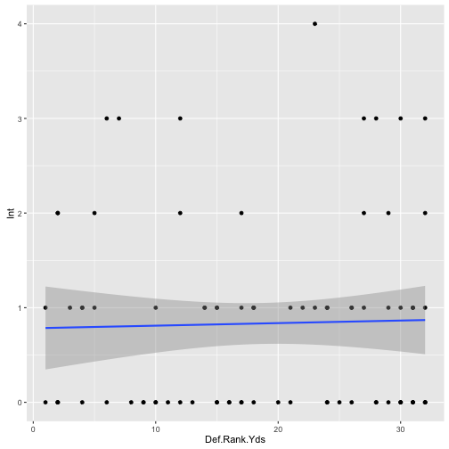
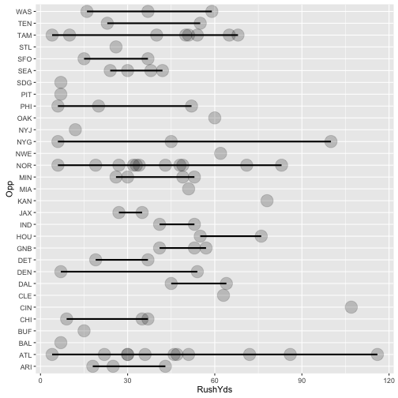

Player analysis and selection for the week of 09.19.2016


QB Analysis - Pull Player Data


# QB Analysis

## Cam Newton - Summary Passing Data

Newton Yards Summary

```
##  Location       Opp      Def.Rank.Yds      PassYds          PassTD     
##  Away:42   ATL    :11   Min.   : 1.00   Min.   :114.0   Min.   :0.000  
##  Home:42   NOR    :11   1st Qu.:10.00   1st Qu.:194.0   1st Qu.:1.000  
##            TAM    : 8   Median :18.00   Median :231.5   Median :1.000  
##            MIN    : 4   Mean   :18.63   Mean   :235.4   Mean   :1.488  
##            SEA    : 4   3rd Qu.:28.00   3rd Qu.:277.0   3rd Qu.:2.000  
##            ARI    : 3   Max.   :32.00   Max.   :432.0   Max.   :5.000  
##            (Other):43                                                  
##       Int            RushYds           RushTD      
##  Min.   :0.0000   Min.   :  4.00   Min.   :0.0000  
##  1st Qu.:0.0000   1st Qu.: 23.75   1st Qu.:0.0000  
##  Median :1.0000   Median : 39.00   Median :0.0000  
##  Mean   :0.8333   Mean   : 40.67   Mean   :0.5476  
##  3rd Qu.:1.0000   3rd Qu.: 53.25   3rd Qu.:1.0000  
##  Max.   :4.0000   Max.   :116.00   Max.   :3.0000  
## 
```

## Exploratory data analysis

### Location analysis


```r
par(mfrow = c(5,2), mar = c(4,4,1,1))
plot(CNdf$Location, CNdf$PassYds, ylab = "Passing Yards", col = "red")
plot(CNdf$Location, CNdf$RushYds, ylab = "Rushing Yards", col = "blue")
plot(CNdf$Location, CNdf$PassTD, ylab = "Passing TDs", col = "green")
plot(CNdf$Location, CNdf$RushTD, ylab = "Rushing TDs", col = "purple")
plot(CNdf$Location, CNdf$Int, ylab = "Interceptions", col = "grey")
```


### Opponent Analysis

Opponent vs. Pass Yards

```r
par(mfrow = c(5,1), mar = c(4,4,1,1))
plot(CNdf$Opp, CNdf$PassYds, ylab = "Yards Passing", xlab = "Opponent", col = "red")
plot(CNdf$Opp, CNdf$RushYds, ylab = "Yards Rushing", xlab = "Opponent", col = "blue")
plot(CNdf$Opp, CNdf$PassTD, ylab = "Passing TDs", xlab = "Opponent", col = "green")
plot(CNdf$Opp, CNdf$RushTD, ylab = "Rushing TDs", xlab = "Opponent", col = "purple")
plot(CNdf$Opp, CNdf$Int, ylab = "Interceptions", xlab = "Opponent", col = "grey")
```


### Defensive Ranking Analysis

Defense rank vs. Pass Yards

```r
library(ggplot2)
par(mfrow = c(5,2), mar = c(4,4,1,1))
qplot(Def.Rank.Yds,PassYds, data = CNdf) + geom_smooth(method = "lm")
```


```r
qplot(Def.Rank.Yds, RushYds, data = CNdf) + geom_smooth(method = "lm")
```


```r
qplot(Def.Rank.Yds, PassTD, data = CNdf) + geom_smooth(method = "lm")
```


```r
qplot(Def.Rank.Yds, RushTD, data = CNdf) + geom_smooth(method = "lm")
```


```r
qplot(Def.Rank.Yds, Int, data = CNdf) + geom_smooth(method = "lm")
```




Newton Yards LSE


## Linear model fitting

### Model fitting vs. Location

Pass Yds vs. Location

```
##                Estimate Std. Error    t value     Pr(>|t|)
## (Intercept)  231.476190   10.01434 23.1144679 1.146648e-37
## LocationHome   7.785714   14.16242  0.5497447 5.839887e-01
```

Prediction interval using a linear model

```
##        fit      lwr      upr
## 1 231.4762 100.8408 362.1116
## 2 231.4762 100.8408 362.1116
## 3 231.4762 100.8408 362.1116
## 4 231.4762 100.8408 362.1116
## 5 231.4762 100.8408 362.1116
## 6 231.4762 100.8408 362.1116
```


Rush Yds. vs. Location

```r
CNfitRushYdsLoc<- lm(RushYds ~ Location, data = CNdf)
summary(CNfitRushYdsLoc)$coefficients
```

```
##               Estimate Std. Error    t value     Pr(>|t|)
## (Intercept)  42.809524   3.719746 11.5087210 8.455620e-19
## LocationHome -4.285714   5.260516 -0.8146947 4.176069e-01
```

Prediction interval using a linear model

```
##        fit       lwr    upr
## 1 42.80952 -5.713951 91.333
## 2 42.80952 -5.713951 91.333
## 3 42.80952 -5.713951 91.333
## 4 42.80952 -5.713951 91.333
## 5 42.80952 -5.713951 91.333
## 6 42.80952 -5.713951 91.333
```

Pass TDs. vs. Location

```
##               Estimate Std. Error   t value     Pr(>|t|)
## (Intercept)  1.4285714  0.1792766 7.9685335 8.064972e-12
## LocationHome 0.1190476  0.2535354 0.4695503 6.399225e-01
```

Prediction interval using a linear model

```
##        fit        lwr      upr
## 1 1.428571 -0.9100618 3.767205
## 2 1.428571 -0.9100618 3.767205
## 3 1.428571 -0.9100618 3.767205
## 4 1.428571 -0.9100618 3.767205
## 5 1.428571 -0.9100618 3.767205
## 6 1.428571 -0.9100618 3.767205
```

Rush TDs vs. Location

```
##                Estimate Std. Error  t value     Pr(>|t|)
## (Intercept)   0.6190476 0.09991424  6.19579 2.207786e-08
## LocationHome -0.1428571 0.14130007 -1.01102 3.149811e-01
```

Prediction interval using a linear model

```
##         fit       lwr      upr
## 1 0.6190476 -0.684317 1.922412
## 2 0.6190476 -0.684317 1.922412
## 3 0.6190476 -0.684317 1.922412
## 4 0.6190476 -0.684317 1.922412
## 5 0.6190476 -0.684317 1.922412
## 6 0.6190476 -0.684317 1.922412
```


#### Model fitting vs. opponent

Pass Yards vs. opponent data

```r
CNfitPassYds<- lm(PassYds ~ Opp, data = CNdf)
summary(CNfitPassYds)$coefficients
```

```
##                 Estimate Std. Error      t value     Pr(>|t|)
## (Intercept)  314.0000000   37.57596  8.356406770 3.029459e-11
## OppATL       -96.6363636   42.39140 -2.279621941 2.668241e-02
## OppBAL      -117.0000000   75.15192 -1.556846484 1.254588e-01
## OppBUF       -85.0000000   75.15192 -1.131042318 2.631294e-01
## OppCHI         0.3333333   53.14043  0.006272688 9.950187e-01
## OppCIN       -30.0000000   75.15192 -0.399191406 6.913562e-01
## OppCLE      -113.0000000   75.15192 -1.503620963 1.386149e-01
## OppDAL      -106.0000000   59.41281 -1.784127080 8.012798e-02
## OppDEN       -96.5000000   59.41281 -1.624228898 1.102602e-01
## OppDET       -33.5000000   59.41281 -0.563851483 5.752335e-01
## OppGNB        -2.6666667   53.14043 -0.050181502 9.601664e-01
## OppHOU      -142.0000000   59.41281 -2.390057032 2.043314e-02
## OppIND       -86.0000000   59.41281 -1.447499329 1.536467e-01
## OppJAX      -147.5000000   59.41281 -2.482629663 1.624279e-02
## OppKAN       -82.0000000   75.15192 -1.091123177 2.801543e-01
## OppMIA      -140.0000000   75.15192 -1.862893229 6.802323e-02
## OppMIN       -67.0000000   49.70832 -1.347862847 1.834357e-01
## OppNOR       -80.4545455   42.39140 -1.897897853 6.316179e-02
## OppNWE      -105.0000000   75.15192 -1.397169922 1.681848e-01
## OppNYG       -45.6666667   53.14043 -0.859358227 3.940132e-01
## OppNYJ       -41.0000000   75.15192 -0.545561589 5.876562e-01
## OppOAK      -144.0000000   75.15192 -1.916118750 6.075031e-02
## OppPHI       -44.3333333   53.14043 -0.834267475 4.078749e-01
## OppPIT       -64.0000000   75.15192 -0.851608333 3.982631e-01
## OppSDG       -83.0000000   75.15192 -1.104429557 2.743958e-01
## OppSEA      -137.5000000   49.70832 -2.766136441 7.791241e-03
## OppSFO       -53.0000000   59.41281 -0.892063540 3.763912e-01
## OppSTL      -110.0000000   75.15192 -1.463701823 1.491815e-01
## OppTAM       -85.1250000   44.06172 -1.931949189 5.871932e-02
## OppTEN       -99.5000000   59.41281 -1.674723061 9.988019e-02
## OppWAS       -79.6666667   53.14043 -1.499172381 1.397623e-01
```

Prediction interval using a linear model

```
##   fit      lwr      upr
## 1 204 19.38727 388.6127
## 2 204 19.38727 388.6127
## 3 204 19.38727 388.6127
## 4 204 19.38727 388.6127
## 5 204 19.38727 388.6127
## 6 204 19.38727 388.6127
```

Rush Yards vs. opponent data


```r
CNfitRushYds<- lm(RushYds ~ Opp, data = CNdf)
summary(CNfitRushYds)$coefficients
```

```
##                Estimate Std. Error     t value    Pr(>|t|)
## (Intercept)  28.6666667   13.64632  2.10068854 0.040441916
## OppATL       20.4242424   15.39512  1.32666952 0.190306056
## OppBAL      -21.6666667   27.29264 -0.79386486 0.430814227
## OppBUF      -13.6666667   27.29264 -0.50074552 0.618623480
## OppCHI       -1.6666667   19.29881 -0.08636111 0.931504803
## OppCIN       78.3333333   27.29264  2.87012679 0.005882711
## OppCLE       34.3333333   27.29264  1.25797046 0.213916617
## OppDAL       25.8333333   21.57673  1.19727775 0.236525971
## OppDEN        1.8333333   21.57673  0.08496810 0.932606909
## OppDET       -0.6666667   21.57673 -0.03089749 0.975467352
## OppGNB       21.6666667   19.29881  1.12269445 0.266627522
## OppHOU       36.8333333   21.57673  1.70708635 0.093658926
## OppIND       18.3333333   21.57673  0.84968099 0.399324437
## OppJAX        2.3333333   21.57673  0.10814122 0.914292038
## OppKAN       49.3333333   27.29264  1.80756921 0.076350104
## OppMIA       22.3333333   27.29264  0.81829147 0.416854747
## OppMIN       10.8333333   18.05238  0.60010542 0.550993345
## OppNOR       11.7878788   15.39512  0.76568908 0.447257940
## OppNWE       33.3333333   27.29264  1.22133055 0.227365995
## OppNYG       21.6666667   19.29881  1.12269445 0.266627522
## OppNYJ      -16.6666667   27.29264 -0.61066527 0.544031201
## OppOAK       31.3333333   27.29264  1.14805071 0.256103198
## OppPHI       -2.6666667   19.29881 -0.13817778 0.890623575
## OppPIT      -21.6666667   27.29264 -0.79386486 0.430814227
## OppSDG      -21.6666667   27.29264 -0.79386486 0.430814227
## OppSEA        4.8333333   18.05238  0.26773934 0.789939195
## OppSFO       -2.6666667   21.57673 -0.12358996 0.902107454
## OppSTL       -2.6666667   27.29264 -0.09770644 0.922533973
## OppTAM       14.0833333   16.00173  0.88011329 0.382771364
## OppTEN       10.3333333   21.57673  0.47891110 0.633971877
## OppWAS        8.6666667   19.29881  0.44907778 0.655206533
```

Prediction interval using a linear model

```
##   fit       lwr      upr
## 1  26 -41.04511 93.04511
## 2  26 -41.04511 93.04511
## 3  26 -41.04511 93.04511
## 4  26 -41.04511 93.04511
## 5  26 -41.04511 93.04511
## 6  26 -41.04511 93.04511
```

Pass TDs vs. opponent data

```r
CNfitPassTD<- lm(PassTD ~ Opp, data = CNdf)
summary(CNfitPassTD)$coefficients
```

```
##               Estimate Std. Error    t value   Pr(>|t|)
## (Intercept)  0.6666667  0.7240525  0.9207436 0.36135643
## OppATL       0.7878788  0.8168413  0.9645432 0.33915419
## OppBAL       0.3333333  1.4481049  0.2301859 0.81883347
## OppBUF       1.3333333  1.4481049  0.9207436 0.36135643
## OppCHI       0.3333333  1.0239648  0.3255320 0.74606017
## OppCIN       1.3333333  1.4481049  0.9207436 0.36135643
## OppCLE       0.3333333  1.4481049  0.2301859 0.81883347
## OppDAL      -0.1666667  1.1448274 -0.1455823 0.88480338
## OppDEN       0.8333333  1.1448274  0.7279117 0.46987138
## OppDET       0.3333333  1.1448274  0.2911647 0.77206183
## OppGNB       1.0000000  1.0239648  0.9765961 0.33320583
## OppHOU       1.3333333  1.1448274  1.1646588 0.24937274
## OppIND       0.3333333  1.1448274  0.2911647 0.77206183
## OppJAX       0.3333333  1.1448274  0.2911647 0.77206183
## OppKAN       2.3333333  1.4481049  1.6113013 0.11305415
## OppMIA       0.3333333  1.4481049  0.2301859 0.81883347
## OppMIN       1.0833333  0.9578314  1.1310272 0.26313568
## OppNOR       0.9696970  0.8168413  1.1871301 0.24046994
## OppNWE       2.3333333  1.4481049  1.6113013 0.11305415
## OppNYG       2.0000000  1.0239648  1.9531921 0.05608525
## OppNYJ       0.3333333  1.4481049  0.2301859 0.81883347
## OppOAK       0.3333333  1.4481049  0.2301859 0.81883347
## OppPHI       1.0000000  1.0239648  0.9765961 0.33320583
## OppPIT       0.3333333  1.4481049  0.2301859 0.81883347
## OppSDG       1.3333333  1.4481049  0.9207436 0.36135643
## OppSEA      -0.1666667  0.9578314 -0.1740042 0.86252511
## OppSFO       1.3333333  1.1448274  1.1646588 0.24937274
## OppSTL       0.3333333  1.4481049  0.2301859 0.81883347
## OppTAM       1.0833333  0.8490268  1.2759708 0.20752953
## OppTEN      -0.1666667  1.1448274 -0.1455823 0.88480338
## OppWAS       1.6666667  1.0239648  1.6276601 0.10952809
```

Prediction interval using a linear model

```
##   fit       lwr      upr
## 1   1 -2.557309 4.557309
## 2   1 -2.557309 4.557309
## 3   1 -2.557309 4.557309
## 4   1 -2.557309 4.557309
## 5   1 -2.557309 4.557309
## 6   1 -2.557309 4.557309
```

Rush TDs vs. opponent data

```r
CNfitRushTD<- lm(RushTD ~ Opp, data = CNdf)
summary(CNfitRushTD)$coefficients
```

```
##                Estimate Std. Error    t value  Pr(>|t|)
## (Intercept)  0.33333333  0.4123706  0.8083343 0.4225117
## OppATL       0.21212121  0.4652168  0.4559620 0.6502801
## OppBAL      -0.33333333  0.8247413 -0.4041671 0.6877162
## OppBUF      -0.33333333  0.8247413 -0.4041671 0.6877162
## OppCHI       0.33333333  0.5831802  0.5715787 0.5700237
## OppCIN       0.66666667  0.8247413  0.8083343 0.4225117
## OppCLE       0.66666667  0.8247413  0.8083343 0.4225117
## OppDAL       0.16666667  0.6520152  0.2556177 0.7992355
## OppDEN       0.16666667  0.6520152  0.2556177 0.7992355
## OppDET       0.66666667  0.6520152  1.0224710 0.3112025
## OppGNB       0.33333333  0.5831802  0.5715787 0.5700237
## OppHOU       0.16666667  0.6520152  0.2556177 0.7992355
## OppIND       0.16666667  0.6520152  0.2556177 0.7992355
## OppJAX      -0.33333333  0.6520152 -0.5112355 0.6113095
## OppKAN      -0.33333333  0.8247413 -0.4041671 0.6877162
## OppMIA       0.66666667  0.8247413  0.8083343 0.4225117
## OppMIN       0.16666667  0.5455151  0.3055216 0.7611657
## OppNOR       0.21212121  0.4652168  0.4559620 0.6502801
## OppNWE      -0.33333333  0.8247413 -0.4041671 0.6877162
## OppNYG       0.33333333  0.5831802  0.5715787 0.5700237
## OppNYJ      -0.33333333  0.8247413 -0.4041671 0.6877162
## OppOAK       0.66666667  0.8247413  0.8083343 0.4225117
## OppPHI       0.66666667  0.5831802  1.1431573 0.2581108
## OppPIT      -0.33333333  0.8247413 -0.4041671 0.6877162
## OppSDG      -0.33333333  0.8247413 -0.4041671 0.6877162
## OppSEA      -0.08333333  0.5455151 -0.1527608 0.8791670
## OppSFO      -0.33333333  0.6520152 -0.5112355 0.6113095
## OppSTL      -0.33333333  0.8247413 -0.4041671 0.6877162
## OppTAM       0.66666667  0.4835474  1.3786996 0.1737790
## OppTEN       0.16666667  0.6520152  0.2556177 0.7992355
## OppWAS       0.33333333  0.5831802  0.5715787 0.5700237
```

Prediction interval using a linear model

```
##            fit       lwr      upr
## 1 9.992007e-16 -2.025999 2.025999
## 2 9.992007e-16 -2.025999 2.025999
## 3 9.992007e-16 -2.025999 2.025999
## 4 9.992007e-16 -2.025999 2.025999
## 5 9.992007e-16 -2.025999 2.025999
## 6 9.992007e-16 -2.025999 2.025999
```

Interceptions vs. opponent data

```r
CNfitInt<- lm(Int ~ Opp, data = CNdf)
summary(CNfitInt)$coefficients
```

```
##                  Estimate Std. Error       t value  Pr(>|t|)
## (Intercept)  1.333333e+00  0.6136355  2.172843e+00 0.0342835
## OppATL      -4.242424e-01  0.6922742 -6.128243e-01 0.5426133
## OppBAL      -1.333333e+00  1.2272710 -1.086421e+00 0.2822092
## OppBUF      -3.333333e-01  1.2272710 -2.716053e-01 0.7869807
## OppCHI      -2.195188e-15  0.8678116 -2.529567e-15 1.0000000
## OppCIN      -3.333333e-01  1.2272710 -2.716053e-01 0.7869807
## OppCLE      -3.333333e-01  1.2272710 -2.716053e-01 0.7869807
## OppDAL      -8.333333e-01  0.9702429 -8.588915e-01 0.3942684
## OppDEN       1.666667e-01  0.9702429  1.717783e-01 0.8642661
## OppDET       6.666667e-01  0.9702429  6.871132e-01 0.4950072
## OppGNB       3.333333e-01  0.8678116  3.841079e-01 0.7024352
## OppHOU      -8.333333e-01  0.9702429 -8.588915e-01 0.3942684
## OppIND      -8.333333e-01  0.9702429 -8.588915e-01 0.3942684
## OppJAX      -8.333333e-01  0.9702429 -8.588915e-01 0.3942684
## OppKAN      -1.333333e+00  1.2272710 -1.086421e+00 0.2822092
## OppMIA      -3.333333e-01  1.2272710 -2.716053e-01 0.7869807
## OppMIN      -3.333333e-01  0.8117634 -4.106287e-01 0.6830003
## OppNOR      -6.969697e-01  0.6922742 -1.006783e+00 0.3186137
## OppNWE      -1.333333e+00  1.2272710 -1.086421e+00 0.2822092
## OppNYG      -9.243760e-17  0.8678116 -1.065180e-16 1.0000000
## OppNYJ      -1.333333e+00  1.2272710 -1.086421e+00 0.2822092
## OppOAK      -3.333333e-01  1.2272710 -2.716053e-01 0.7869807
## OppPHI       6.666667e-01  0.8678116  7.682159e-01 0.4457684
## OppPIT      -1.333333e+00  1.2272710 -1.086421e+00 0.2822092
## OppSDG      -1.333333e+00  1.2272710 -1.086421e+00 0.2822092
## OppSEA      -5.833333e-01  0.8117634 -7.186002e-01 0.4755435
## OppSFO      -3.333333e-01  0.9702429 -3.435566e-01 0.7325390
## OppSTL      -1.333333e+00  1.2272710 -1.086421e+00 0.2822092
## OppTAM      -8.333333e-01  0.7195514 -1.158129e+00 0.2520036
## OppTEN      -8.333333e-01  0.9702429 -8.588915e-01 0.3942684
## OppWAS      -1.333333e+00  0.8678116 -1.536432e+00 0.1303815
```

Prediction interval using a linear model

```
##            fit       lwr      upr
## 1 6.661338e-16 -3.014824 3.014824
## 2 6.661338e-16 -3.014824 3.014824
## 3 6.661338e-16 -3.014824 3.014824
## 4 6.661338e-16 -3.014824 3.014824
## 5 6.661338e-16 -3.014824 3.014824
## 6 6.661338e-16 -3.014824 3.014824
```

### Model fitting vs. defensive rank

Pass Yards vs. Defensive Rank

```
##                Estimate Std. Error   t value     Pr(>|t|)
## (Intercept)  209.684496 14.6329907 14.329572 4.863700e-24
## Def.Rank.Yds   1.378596  0.6917944  1.992783 4.961161e-02
```

Prediction interval using a linear model

```
##        fit      lwr      upr
## 1 223.4705 95.84432 351.0966
## 2 223.4705 95.84432 351.0966
## 3 223.4705 95.84432 351.0966
## 4 223.4705 95.84432 351.0966
## 5 223.4705 95.84432 351.0966
## 6 223.4705 95.84432 351.0966
```

Rush Yards vs. Defensive Rank

```
##               Estimate Std. Error  t value     Pr(>|t|)
## (Intercept)  31.636691   5.461463 5.792714 1.236875e-07
## Def.Rank.Yds  0.484676   0.258198 1.877149 6.405391e-02
```

Prediction interval using a linear model

```
##        fit       lwr      upr
## 1 36.48345 -11.15038 84.11728
## 2 36.48345 -11.15038 84.11728
## 3 36.48345 -11.15038 84.11728
## 4 36.48345 -11.15038 84.11728
## 5 36.48345 -11.15038 84.11728
## 6 36.48345 -11.15038 84.11728
```

Pass TDs vs. Defensive Rank

```
##                Estimate Std. Error  t value    Pr(>|t|)
## (Intercept)  0.76030700 0.25208857 3.016031 0.003409254
## Def.Rank.Yds 0.03906339 0.01191783 3.277728 0.001535963
```

Prediction interval using a linear model

```
##        fit       lwr      upr
## 1 1.150941 -1.047727 3.349609
## 2 1.150941 -1.047727 3.349609
## 3 1.150941 -1.047727 3.349609
## 4 1.150941 -1.047727 3.349609
## 5 1.150941 -1.047727 3.349609
## 6 1.150941 -1.047727 3.349609
```

Rush TDs vs. Defensive Rank

```
##                Estimate Std. Error  t value   Pr(>|t|)
## (Intercept)  0.28453388  0.1464728 1.942571 0.05550046
## Def.Rank.Yds 0.01412087  0.0069247 2.039202 0.04465064
```

Prediction interval using a linear model

```
##         fit        lwr     upr
## 1 0.4257425 -0.8517653 1.70325
## 2 0.4257425 -0.8517653 1.70325
## 3 0.4257425 -0.8517653 1.70325
## 4 0.4257425 -0.8517653 1.70325
## 5 0.4257425 -0.8517653 1.70325
## 6 0.4257425 -0.8517653 1.70325
```

Interceptions vs. Defensive Rank

```
##                 Estimate Std. Error   t value    Pr(>|t|)
## (Intercept)  0.782843304 0.22988339 3.4053930 0.001025241
## Def.Rank.Yds 0.002710008 0.01086805 0.2493556 0.803709321
```

Prediction interval using a linear model

```
##         fit       lwr      upr
## 1 0.8099434 -1.195055 2.814942
## 2 0.8099434 -1.195055 2.814942
## 3 0.8099434 -1.195055 2.814942
## 4 0.8099434 -1.195055 2.814942
## 5 0.8099434 -1.195055 2.814942
## 6 0.8099434 -1.195055 2.814942
```


###Newton Pass Yards Plot of Data Yards against opponents

```
## Warning in qt((1 - level)/2, df): NaNs produced

## Warning in qt((1 - level)/2, df): NaNs produced

## Warning in qt((1 - level)/2, df): NaNs produced

## Warning in qt((1 - level)/2, df): NaNs produced

## Warning in qt((1 - level)/2, df): NaNs produced

## Warning in qt((1 - level)/2, df): NaNs produced

## Warning in qt((1 - level)/2, df): NaNs produced

## Warning in qt((1 - level)/2, df): NaNs produced
```


Newton Rush Yards Plot of Data Yards against opponents

```
## Warning in qt((1 - level)/2, df): NaNs produced

## Warning in qt((1 - level)/2, df): NaNs produced

## Warning in qt((1 - level)/2, df): NaNs produced

## Warning in qt((1 - level)/2, df): NaNs produced

## Warning in qt((1 - level)/2, df): NaNs produced

## Warning in qt((1 - level)/2, df): NaNs produced

## Warning in qt((1 - level)/2, df): NaNs produced

## Warning in qt((1 - level)/2, df): NaNs produced
```



Newton TDs Plot of Data Yards against opponents

```
## Warning in qt((1 - level)/2, df): NaNs produced

## Warning in qt((1 - level)/2, df): NaNs produced

## Warning in qt((1 - level)/2, df): NaNs produced

## Warning in qt((1 - level)/2, df): NaNs produced

## Warning in qt((1 - level)/2, df): NaNs produced
```


## Machine Learning Alogorithm (Pass Yards)

### Data Splitting

In this data splitting action, I am splitting the data into 60% training set and 40% testing set.

```
##  Location       Opp      Def.Rank.Yds      PassYds          PassTD     
##  Away:42   ATL    :11   Min.   : 1.00   Min.   :114.0   Min.   :0.000  
##  Home:42   NOR    :11   1st Qu.:10.00   1st Qu.:194.0   1st Qu.:1.000  
##            TAM    : 8   Median :18.00   Median :231.5   Median :1.000  
##            MIN    : 4   Mean   :18.63   Mean   :235.4   Mean   :1.488  
##            SEA    : 4   3rd Qu.:28.00   3rd Qu.:277.0   3rd Qu.:2.000  
##            ARI    : 3   Max.   :32.00   Max.   :432.0   Max.   :5.000  
##            (Other):43                                                  
##       Int            RushYds           RushTD      
##  Min.   :0.0000   Min.   :  4.00   Min.   :0.0000  
##  1st Qu.:0.0000   1st Qu.: 23.75   1st Qu.:0.0000  
##  Median :1.0000   Median : 39.00   Median :0.0000  
##  Mean   :0.8333   Mean   : 40.67   Mean   :0.5476  
##  3rd Qu.:1.0000   3rd Qu.: 53.25   3rd Qu.:1.0000  
##  Max.   :4.0000   Max.   :116.00   Max.   :3.0000  
## 
```

```
## [1] 52  8
```

```
## [1] 32  8
```

## K-Fold Cross Validation

We will then use the K-Fold process to cross-validate the data by splitting the training set in to many, smaller data sets.

Here, I am creating 10 folds and setting a random number seed of 32323 for the study. Each fold has approximately the same number of samples in it.

```r
set.seed(32323)
Passfolds <- createFolds(y=CNdf$PassYds,k=10,list=TRUE,returnTrain=TRUE)
sapply(Passfolds,length)
```

```
## Fold01 Fold02 Fold03 Fold04 Fold05 Fold06 Fold07 Fold08 Fold09 Fold10 
##     74     75     76     76     76     76     75     76     76     76
```

```r
Passfolds[[1]][1:10]
```

```
##  [1]  1  2  3  4  5  7  8  9 10 11
```

## Machine learning alogorithm decisioning

First I wanted to determine the optimal machine learning model to use.  The first test I used the Decision Tree approach.  I followed up by testing the Random Forest approach.

### Machine learning using Decision Trees

The first task was to determine model fit.


Next, construct a Decision Tree graph

```r
fancyRpartPlot(modelFitPass)
```


## Machine Learning Alogorithm (Rush Yards)

### Data Splitting

In this data splitting action, I am splitting the data into 60% training set and 40% testing set.

```
##  Location       Opp      Def.Rank.Yds      PassYds          PassTD     
##  Away:42   ATL    :11   Min.   : 1.00   Min.   :114.0   Min.   :0.000  
##  Home:42   NOR    :11   1st Qu.:10.00   1st Qu.:194.0   1st Qu.:1.000  
##            TAM    : 8   Median :18.00   Median :231.5   Median :1.000  
##            MIN    : 4   Mean   :18.63   Mean   :235.4   Mean   :1.488  
##            SEA    : 4   3rd Qu.:28.00   3rd Qu.:277.0   3rd Qu.:2.000  
##            ARI    : 3   Max.   :32.00   Max.   :432.0   Max.   :5.000  
##            (Other):43                                                  
##       Int            RushYds           RushTD      
##  Min.   :0.0000   Min.   :  4.00   Min.   :0.0000  
##  1st Qu.:0.0000   1st Qu.: 23.75   1st Qu.:0.0000  
##  Median :1.0000   Median : 39.00   Median :0.0000  
##  Mean   :0.8333   Mean   : 40.67   Mean   :0.5476  
##  3rd Qu.:1.0000   3rd Qu.: 53.25   3rd Qu.:1.0000  
##  Max.   :4.0000   Max.   :116.00   Max.   :3.0000  
## 
```

```
## [1] 52  8
```

```
## [1] 32  8
```

We will then use the K-Fold process to cross-validate the data by splitting the training set in to many, smaller data sets.

Here, I am creating 10 folds and setting a random number seed of 32323 for the study. Each fold has approximately the same number of samples in it.

```r
set.seed(32323)
Passfolds <- createFolds(y=CNdf$RushYds,k=10,list=TRUE,returnTrain=TRUE)
sapply(Passfolds,length)
```

```
## Fold01 Fold02 Fold03 Fold04 Fold05 Fold06 Fold07 Fold08 Fold09 Fold10 
##     74     75     76     75     76     76     76     76     76     76
```

```r
Passfolds[[1]][1:10]
```

```
##  [1]  1  2  3  5  6  8  9 10 11 12
```

Decision tree model fit Rush Yards Defense Rank.


Pass Yards decision tree graph

```r
fancyRpartPlot(modelFitRush)
```


### Machine learning using Decision Trees

The first task was to determine model fit.


### Output from Decision Tree Model vs. Yards Passing

Current week (9) opponent L.A. Rams (formerly St. Louis Rams).  The defense is currently ranked # 10 according to www.pro-football-reference.com.

According to the model, there is a 60% chance that Cam Newton will pass for 240 yards.  This takes in to account defense rank ONLY.  There is an 18.0% chance Cam will rush for 25 yards.  Once again this takes in to account defense rank ONLY.

We will now use the LM model for prediction (Pass Yds)

```
##        1        2        3        4        5        6        7        8 
## 195.5174 195.5174 195.5174 195.5174 195.5174 195.5174 195.5174 195.5174 
##        9       10       11       12       13       14       15       16 
## 195.5174 195.5174 195.5174 195.5174 195.5174 195.5174 195.5174 195.5174 
##       17       18       19       20       21       22       23       24 
## 195.5174 195.5174 195.5174 195.5174 195.5174 195.5174 195.5174 195.5174 
##       25       26       27       28       29       30       31       32 
## 195.5174 195.5174 195.5174 195.5174 195.5174 195.5174 195.5174 195.5174 
##       33       34       35       36       37       38       39       40 
## 195.5174 195.5174 195.5174 195.5174 195.5174 195.5174 195.5174 195.5174 
##       41       42       43       44       45       46       47       48 
## 195.5174 195.5174 195.5174 195.5174 195.5174 195.5174 195.5174 195.5174 
##       49       50       51       52       53       54       55       56 
## 195.5174 195.5174 195.5174 195.5174 195.5174 195.5174 195.5174 195.5174 
##       57       58       59       60       61       62       63       64 
## 195.5174 195.5174 195.5174 195.5174 195.5174 195.5174 195.5174 195.5174 
##       65       66       67       68       69       70       71       72 
## 195.5174 195.5174 195.5174 195.5174 195.5174 195.5174 195.5174 195.5174 
##       73       74       75       76       77       78       79       80 
## 195.5174 195.5174 195.5174 195.5174 195.5174 195.5174 195.5174 195.5174 
##       81       82       83       84 
## 195.5174 195.5174 195.5174 195.5174
```

Predicted passing points

```
##        1        2        3        4        5        6        7        8 
## 7.820694 7.820694 7.820694 7.820694 7.820694 7.820694 7.820694 7.820694 
##        9       10       11       12       13       14       15       16 
## 7.820694 7.820694 7.820694 7.820694 7.820694 7.820694 7.820694 7.820694 
##       17       18       19       20       21       22       23       24 
## 7.820694 7.820694 7.820694 7.820694 7.820694 7.820694 7.820694 7.820694 
##       25       26       27       28       29       30       31       32 
## 7.820694 7.820694 7.820694 7.820694 7.820694 7.820694 7.820694 7.820694 
##       33       34       35       36       37       38       39       40 
## 7.820694 7.820694 7.820694 7.820694 7.820694 7.820694 7.820694 7.820694 
##       41       42       43       44       45       46       47       48 
## 7.820694 7.820694 7.820694 7.820694 7.820694 7.820694 7.820694 7.820694 
##       49       50       51       52       53       54       55       56 
## 7.820694 7.820694 7.820694 7.820694 7.820694 7.820694 7.820694 7.820694 
##       57       58       59       60       61       62       63       64 
## 7.820694 7.820694 7.820694 7.820694 7.820694 7.820694 7.820694 7.820694 
##       65       66       67       68       69       70       71       72 
## 7.820694 7.820694 7.820694 7.820694 7.820694 7.820694 7.820694 7.820694 
##       73       74       75       76       77       78       79       80 
## 7.820694 7.820694 7.820694 7.820694 7.820694 7.820694 7.820694 7.820694 
##       81       82       83       84 
## 7.820694 7.820694 7.820694 7.820694
```

We will now use the LM model for prediction (Rush Yds)

```
##        1        2        3        4        5        6        7        8 
## 24.73227 24.73227 24.73227 24.73227 24.73227 24.73227 24.73227 24.73227 
##        9       10       11       12       13       14       15       16 
## 24.73227 24.73227 24.73227 24.73227 24.73227 24.73227 24.73227 24.73227 
##       17       18       19       20       21       22       23       24 
## 24.73227 24.73227 24.73227 24.73227 24.73227 24.73227 24.73227 24.73227 
##       25       26       27       28       29       30       31       32 
## 24.73227 24.73227 24.73227 24.73227 24.73227 24.73227 24.73227 24.73227 
##       33       34       35       36       37       38       39       40 
## 24.73227 24.73227 24.73227 24.73227 24.73227 24.73227 24.73227 24.73227 
##       41       42       43       44       45       46       47       48 
## 24.73227 24.73227 24.73227 24.73227 24.73227 24.73227 24.73227 24.73227 
##       49       50       51       52       53       54       55       56 
## 24.73227 24.73227 24.73227 24.73227 24.73227 24.73227 24.73227 24.73227 
##       57       58       59       60       61       62       63       64 
## 24.73227 24.73227 24.73227 24.73227 24.73227 24.73227 24.73227 24.73227 
##       65       66       67       68       69       70       71       72 
## 24.73227 24.73227 24.73227 24.73227 24.73227 24.73227 24.73227 24.73227 
##       73       74       75       76       77       78       79       80 
## 24.73227 24.73227 24.73227 24.73227 24.73227 24.73227 24.73227 24.73227 
##       81       82       83       84 
## 24.73227 24.73227 24.73227 24.73227
```

Predicted rushing points

```
##        1        2        3        4        5        6        7        8 
## 2.473227 2.473227 2.473227 2.473227 2.473227 2.473227 2.473227 2.473227 
##        9       10       11       12       13       14       15       16 
## 2.473227 2.473227 2.473227 2.473227 2.473227 2.473227 2.473227 2.473227 
##       17       18       19       20       21       22       23       24 
## 2.473227 2.473227 2.473227 2.473227 2.473227 2.473227 2.473227 2.473227 
##       25       26       27       28       29       30       31       32 
## 2.473227 2.473227 2.473227 2.473227 2.473227 2.473227 2.473227 2.473227 
##       33       34       35       36       37       38       39       40 
## 2.473227 2.473227 2.473227 2.473227 2.473227 2.473227 2.473227 2.473227 
##       41       42       43       44       45       46       47       48 
## 2.473227 2.473227 2.473227 2.473227 2.473227 2.473227 2.473227 2.473227 
##       49       50       51       52       53       54       55       56 
## 2.473227 2.473227 2.473227 2.473227 2.473227 2.473227 2.473227 2.473227 
##       57       58       59       60       61       62       63       64 
## 2.473227 2.473227 2.473227 2.473227 2.473227 2.473227 2.473227 2.473227 
##       65       66       67       68       69       70       71       72 
## 2.473227 2.473227 2.473227 2.473227 2.473227 2.473227 2.473227 2.473227 
##       73       74       75       76       77       78       79       80 
## 2.473227 2.473227 2.473227 2.473227 2.473227 2.473227 2.473227 2.473227 
##       81       82       83       84 
## 2.473227 2.473227 2.473227 2.473227
```

We will now use the LM model for prediction (Pass TDs)

```
##         1         2         3         4         5         6         7 
## 0.8045535 0.8045535 0.8045535 0.8045535 0.8045535 0.8045535 0.8045535 
##         8         9        10        11        12        13        14 
## 0.8045535 0.8045535 0.8045535 0.8045535 0.8045535 0.8045535 0.8045535 
##        15        16        17        18        19        20        21 
## 0.8045535 0.8045535 0.8045535 0.8045535 0.8045535 0.8045535 0.8045535 
##        22        23        24        25        26        27        28 
## 0.8045535 0.8045535 0.8045535 0.8045535 0.8045535 0.8045535 0.8045535 
##        29        30        31        32        33        34        35 
## 0.8045535 0.8045535 0.8045535 0.8045535 0.8045535 0.8045535 0.8045535 
##        36        37        38        39        40        41        42 
## 0.8045535 0.8045535 0.8045535 0.8045535 0.8045535 0.8045535 0.8045535 
##        43        44        45        46        47        48        49 
## 0.8045535 0.8045535 0.8045535 0.8045535 0.8045535 0.8045535 0.8045535 
##        50        51        52        53        54        55        56 
## 0.8045535 0.8045535 0.8045535 0.8045535 0.8045535 0.8045535 0.8045535 
##        57        58        59        60        61        62        63 
## 0.8045535 0.8045535 0.8045535 0.8045535 0.8045535 0.8045535 0.8045535 
##        64        65        66        67        68        69        70 
## 0.8045535 0.8045535 0.8045535 0.8045535 0.8045535 0.8045535 0.8045535 
##        71        72        73        74        75        76        77 
## 0.8045535 0.8045535 0.8045535 0.8045535 0.8045535 0.8045535 0.8045535 
##        78        79        80        81        82        83        84 
## 0.8045535 0.8045535 0.8045535 0.8045535 0.8045535 0.8045535 0.8045535
```

Predicted rushing points

```
##        1        2        3        4        5        6        7        8 
## 3.218214 3.218214 3.218214 3.218214 3.218214 3.218214 3.218214 3.218214 
##        9       10       11       12       13       14       15       16 
## 3.218214 3.218214 3.218214 3.218214 3.218214 3.218214 3.218214 3.218214 
##       17       18       19       20       21       22       23       24 
## 3.218214 3.218214 3.218214 3.218214 3.218214 3.218214 3.218214 3.218214 
##       25       26       27       28       29       30       31       32 
## 3.218214 3.218214 3.218214 3.218214 3.218214 3.218214 3.218214 3.218214 
##       33       34       35       36       37       38       39       40 
## 3.218214 3.218214 3.218214 3.218214 3.218214 3.218214 3.218214 3.218214 
##       41       42       43       44       45       46       47       48 
## 3.218214 3.218214 3.218214 3.218214 3.218214 3.218214 3.218214 3.218214 
##       49       50       51       52       53       54       55       56 
## 3.218214 3.218214 3.218214 3.218214 3.218214 3.218214 3.218214 3.218214 
##       57       58       59       60       61       62       63       64 
## 3.218214 3.218214 3.218214 3.218214 3.218214 3.218214 3.218214 3.218214 
##       65       66       67       68       69       70       71       72 
## 3.218214 3.218214 3.218214 3.218214 3.218214 3.218214 3.218214 3.218214 
##       73       74       75       76       77       78       79       80 
## 3.218214 3.218214 3.218214 3.218214 3.218214 3.218214 3.218214 3.218214 
##       81       82       83       84 
## 3.218214 3.218214 3.218214 3.218214
```

We will now use the LM model for prediction (Rush TDs)

```
##           1           2           3           4           5           6 
## -0.05003085 -0.05003085 -0.05003085 -0.05003085 -0.05003085 -0.05003085 
##           7           8           9          10          11          12 
## -0.05003085 -0.05003085 -0.05003085 -0.05003085 -0.05003085 -0.05003085 
##          13          14          15          16          17          18 
## -0.05003085 -0.05003085 -0.05003085 -0.05003085 -0.05003085 -0.05003085 
##          19          20          21          22          23          24 
## -0.05003085 -0.05003085 -0.05003085 -0.05003085 -0.05003085 -0.05003085 
##          25          26          27          28          29          30 
## -0.05003085 -0.05003085 -0.05003085 -0.05003085 -0.05003085 -0.05003085 
##          31          32          33          34          35          36 
## -0.05003085 -0.05003085 -0.05003085 -0.05003085 -0.05003085 -0.05003085 
##          37          38          39          40          41          42 
## -0.05003085 -0.05003085 -0.05003085 -0.05003085 -0.05003085 -0.05003085 
##          43          44          45          46          47          48 
## -0.05003085 -0.05003085 -0.05003085 -0.05003085 -0.05003085 -0.05003085 
##          49          50          51          52          53          54 
## -0.05003085 -0.05003085 -0.05003085 -0.05003085 -0.05003085 -0.05003085 
##          55          56          57          58          59          60 
## -0.05003085 -0.05003085 -0.05003085 -0.05003085 -0.05003085 -0.05003085 
##          61          62          63          64          65          66 
## -0.05003085 -0.05003085 -0.05003085 -0.05003085 -0.05003085 -0.05003085 
##          67          68          69          70          71          72 
## -0.05003085 -0.05003085 -0.05003085 -0.05003085 -0.05003085 -0.05003085 
##          73          74          75          76          77          78 
## -0.05003085 -0.05003085 -0.05003085 -0.05003085 -0.05003085 -0.05003085 
##          79          80          81          82          83          84 
## -0.05003085 -0.05003085 -0.05003085 -0.05003085 -0.05003085 -0.05003085
```

Predicted rushing TD points

```
##          1          2          3          4          5          6 
## -0.3001851 -0.3001851 -0.3001851 -0.3001851 -0.3001851 -0.3001851 
##          7          8          9         10         11         12 
## -0.3001851 -0.3001851 -0.3001851 -0.3001851 -0.3001851 -0.3001851 
##         13         14         15         16         17         18 
## -0.3001851 -0.3001851 -0.3001851 -0.3001851 -0.3001851 -0.3001851 
##         19         20         21         22         23         24 
## -0.3001851 -0.3001851 -0.3001851 -0.3001851 -0.3001851 -0.3001851 
##         25         26         27         28         29         30 
## -0.3001851 -0.3001851 -0.3001851 -0.3001851 -0.3001851 -0.3001851 
##         31         32         33         34         35         36 
## -0.3001851 -0.3001851 -0.3001851 -0.3001851 -0.3001851 -0.3001851 
##         37         38         39         40         41         42 
## -0.3001851 -0.3001851 -0.3001851 -0.3001851 -0.3001851 -0.3001851 
##         43         44         45         46         47         48 
## -0.3001851 -0.3001851 -0.3001851 -0.3001851 -0.3001851 -0.3001851 
##         49         50         51         52         53         54 
## -0.3001851 -0.3001851 -0.3001851 -0.3001851 -0.3001851 -0.3001851 
##         55         56         57         58         59         60 
## -0.3001851 -0.3001851 -0.3001851 -0.3001851 -0.3001851 -0.3001851 
##         61         62         63         64         65         66 
## -0.3001851 -0.3001851 -0.3001851 -0.3001851 -0.3001851 -0.3001851 
##         67         68         69         70         71         72 
## -0.3001851 -0.3001851 -0.3001851 -0.3001851 -0.3001851 -0.3001851 
##         73         74         75         76         77         78 
## -0.3001851 -0.3001851 -0.3001851 -0.3001851 -0.3001851 -0.3001851 
##         79         80         81         82         83         84 
## -0.3001851 -0.3001851 -0.3001851 -0.3001851 -0.3001851 -0.3001851
```

Total predicted points using linear regression models

```
##        1        2        3        4        5        6        7        8 
## 13.21195 13.21195 13.21195 13.21195 13.21195 13.21195 13.21195 13.21195 
##        9       10       11       12       13       14       15       16 
## 13.21195 13.21195 13.21195 13.21195 13.21195 13.21195 13.21195 13.21195 
##       17       18       19       20       21       22       23       24 
## 13.21195 13.21195 13.21195 13.21195 13.21195 13.21195 13.21195 13.21195 
##       25       26       27       28       29       30       31       32 
## 13.21195 13.21195 13.21195 13.21195 13.21195 13.21195 13.21195 13.21195 
##       33       34       35       36       37       38       39       40 
## 13.21195 13.21195 13.21195 13.21195 13.21195 13.21195 13.21195 13.21195 
##       41       42       43       44       45       46       47       48 
## 13.21195 13.21195 13.21195 13.21195 13.21195 13.21195 13.21195 13.21195 
##       49       50       51       52       53       54       55       56 
## 13.21195 13.21195 13.21195 13.21195 13.21195 13.21195 13.21195 13.21195 
##       57       58       59       60       61       62       63       64 
## 13.21195 13.21195 13.21195 13.21195 13.21195 13.21195 13.21195 13.21195 
##       65       66       67       68       69       70       71       72 
## 13.21195 13.21195 13.21195 13.21195 13.21195 13.21195 13.21195 13.21195 
##       73       74       75       76       77       78       79       80 
## 13.21195 13.21195 13.21195 13.21195 13.21195 13.21195 13.21195 13.21195 
##       81       82       83       84 
## 13.21195 13.21195 13.21195 13.21195
```

Outcome:  Cam Newton's predicted point total for Week 9 against the LA Rams is 13.21 points.  NFL.com is predicting that Cam's point total will be 15.44 points


```
## 
## 
## processing file: QB_ML_Experiment_2016.Rmd
```

```
## Error in parse_block(g[-1], g[1], params.src): duplicate label 'Points'
```
